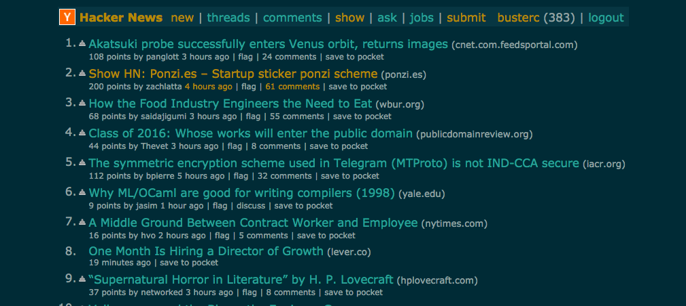

Hacker News - Solarized Dark
==
A solarized dark theme user-style for http://news.ycombinator.com

Get the 'Stylish' Browser Extension
--
  - [Chrome](https://chrome.google.com/webstore/detail/stylish/fjnbnpbmkenffdnngjfgmeleoegfcffe)
  - [Firefox](https://addons.mozilla.org/en-US/firefox/addon/stylish/)
  - [Safari](http://sobolev.us/stylish/)

Install This Theme From UserStyles.org
--
http://userstyles.org/styles/92693/dark-hacker-news-solarized

Pull Requests Are Welcomed
--
Help improve this user style and recommend new ones

Acknowledgements
--
Thanks to Ethan Schoonover for devising "[Solarized](https://github.com/altercation/solarized)"

License (CC0 1.0)
--

